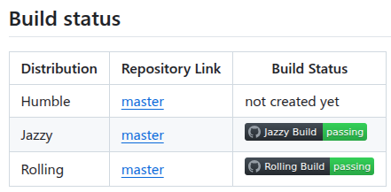

# 使用

## ROS2 Launch 说明

### 使用复杂版 ros2 launch
说明：需要修改 setup.py 将 demo.launch.py 拷贝到 install 文件夹爱
```bash
# 进入工作目录
source install/setup.bash
ros2 launch test_pkg demo.launch.py
```

### 使用简化版 ros2 launch
```bash
# 进入包中的 launch 文件夹
ros2 launch launch.py 
```

## 项目使用方法

### ROS2 文件使用方法
```bash
./test.sh
```

### ROS2 Rqt Plot 可视化
```bash
rqt -plot

# Plugin -> Visualization -> Plot
```

### ROS2 Debug
1. 安装 ROS 插件 (Microsoft 官方插件)  
2. 点击左侧 Run and Debug 图标 -> Create launch.json file -> ROS -> ROS2: launch -> 选择debug的包 -> 选择启动的 launch 文件

## 日志
- **2025.5.25 周日**
  - 编译 ros2_control_demo_example_2 出现报错 找不到 ros2_control_cmake 依赖包 (Humble 与 Jazzy 均出现该报错)
    ```bash
    Could not find a package configuration file provided by
    "ros2_control_cmake" with any of the following names:

      ros2_control_cmakeConfig.cmake
      ros2_control_cmake-config.cmake
    ```
  - 使用 Jazzy 单独安装 ros2-control-cmake 解决问题
    ```bash
    apt search ros-jazzy-ros2-control-cmake   # 搜索包
    ros2 pkg list | grep ros2_control_cmake   # 检查是否有 ros2_control_cmake 包
    sudo apt install ros-$ROS_DISTRO-ros2-control
    sudo apt install ros-$ROS_DISTRO-ros2-control-cmake
    sudo apt install ros-$ROS_DISTRO-ros2-controllers
    source /opt/ros/$ROS_DISTRO/setup.bash
    ```
  - 注意 ros2 humble 好像没有 apt 的 ros2_control_cmake 包，可能需要手动编译安装
  - 详见该网站 https://github.com/ros-controls/ros2_control_cmake/tree/master
  
  - 为方便起见转移至 Jazzy 进行 ros2 开发
  - 运行 ros2 launch ros2_control_demo_example_2 diffbot.launch.py 出现新报错
    ```bash
    [ERROR] [launch]: Caught exception in launch (see debug for traceback): executable '[<launch.substitutions.text_substitution.TextSubstitution object at 0x7c869c073470>]' not found on the PATH
    ```
  - 安装依赖 
    ```bash  
    rosdep update
    rosdep install --from-paths src --ignore-src -r -y
    ```
- **2025.6.15 周日**
  ```bash
  # 测试 ros2_control_demo_example_2 
  # 参考教程：https://www.youtube.com/watch?v=J02jEKawE5U&t=314s

  # Document/test_ws/src
  cd src
  git clone https://github.com/ros-controls/ros2_control_demos

  # Document/test_ws 安装依赖
  # 否则会报错 cant find ros2_control_demo_description package
  cd ..
  rosdep install --from-paths src --ignore-src -r -y

  # 编译
  colcon build --symlink-install --packages-select ros2_control_demo_example_2
  source install/setup.bash

  # 运行 Example 2
  ros2 launch ros2_control_demo_example_2 diffbot.launch.py
  ros2 run teleop_twist_keyboard teleop_twist_keyboard --ros-args -p stamped:=true

  ```

